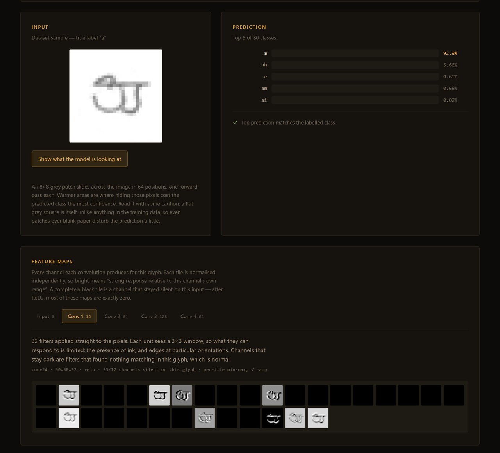
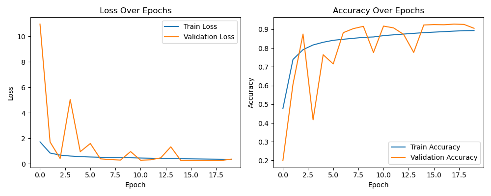
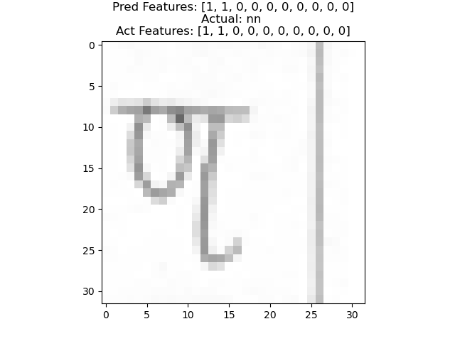
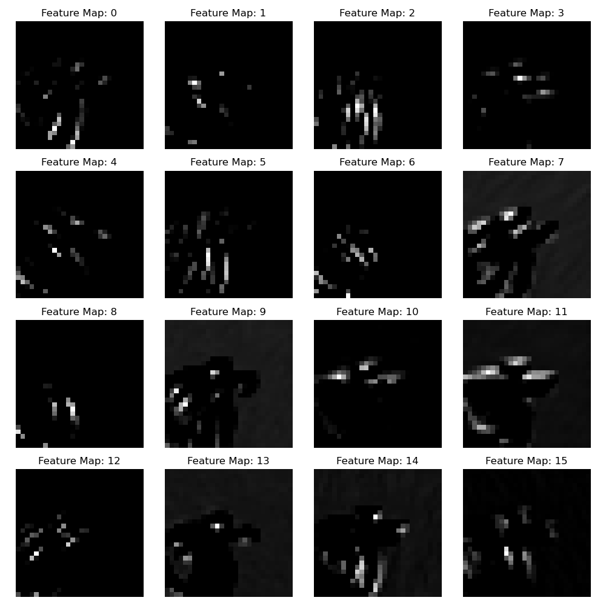
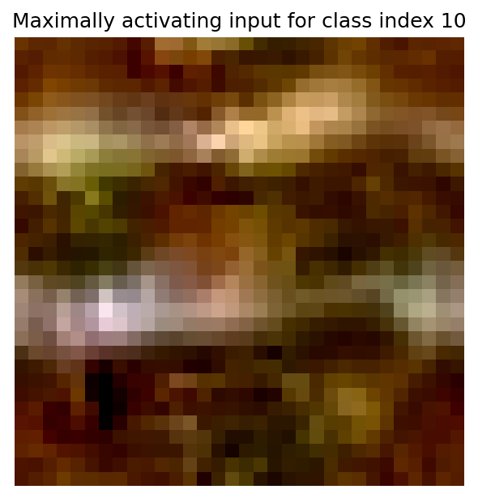

# Feature Extraction from Ancient Script

**A convolutional network that reads handwritten MODI — a historical Marathi script — and shows you the features it extracts along the way.**

MODI was used to write Marathi from roughly the 13th century until the mid-20th,
when Devanagari replaced it. A great deal of administrative and historical record
survives in MODI and comparatively few people can still read it. This project
trains a small CNN to recognise MODI characters, extends it to Devanagari, and
then opens the network up — visualising what each convolutional layer responds
to, and which strokes a prediction actually depends on.

**[Try the live demo →](https://ssavan99.github.io/FeatureExtraction_from_AncientScript/)** — pick a real MODI glyph and watch the feature maps light up, entirely in your browser. No install, no server.



---

## What it does

Three things, in order:

1. **Character recognition.** Given a 32×32 image of a handwritten glyph, predict
   which character it is — across 47 MODI classes, or 80 classes spanning MODI
   and Devanagari together.
2. **Feature extraction.** Tap any convolutional layer and render every channel's
   activation, showing how the representation moves from strokes and edges to
   larger combinations of them.
3. **Stroke decomposition (a negative result).** An attempt to predict which of
   ten stroke primitives — `(` `o` `\` `||` `X` `^` `v` `>` `|` `/\` — compose a
   glyph. This did not work; see [Limitations](#limitations).

## Quickstart

Requires Python 3.8–3.10. **No dataset download is needed** — the trained models
and 47 sample glyphs are in the repo.

```bash
git clone https://github.com/Ssavan99/FeatureExtraction_from_AncientScript.git
cd FeatureExtraction_from_AncientScript
pip install -r requirements.txt
```

Classify a character:

```bash
python -m src.predict feature_data/m/m1.jpg
```

```
feature_data/m/m1.jpg  (model 1, 47-class MODI)

  1. m   84.81%  ##################################
  2. k   15.18%  ######
  3. ph   0.00%
  4. bh   0.00%
  5. jh   0.00%

  stroke primitives of 'm': o |
```

Render the feature maps a layer extracts:

```bash
python -m src.featuremaps feature_data/k/k1.jpg --layer all -o out
```

Run the test suite:

```bash
pytest -q
```

19 tests, all against committed artifacts — no dataset, no GPU, about 50 seconds
on CPU.

## Results

Both models are the same ~175k-parameter CNN on 32×32 RGB input:

```
Conv2D(32,3×3) → BatchNorm → Conv2D(64,3×3) → MaxPool(2×2) → Dropout(0.3)
  → Conv2D(128,3×3) → BatchNorm → Conv2D(64,3×3)
  → GlobalAveragePooling → Dense(64) → Dropout(0.5) → Dense(n)
```

### Character recognition

| Model | Classes | Test accuracy | Precision | Recall | Test loss |
|---|---|---|---|---|---|
| **Model 1** — MODI only | 47 | **88.97 %** | 92.73 % | 86.56 % | 0.395 |
| **Model 2** — MODI + Devanagari | 80 | **90.23 %** | 92.55 % | 88.66 % | 0.383 |

Trained on ~475k and ~547k images respectively, 60/20/20 train/val/test,
Adam at 5e-3, early stopping on validation loss.

Model 2 scoring slightly higher than Model 1 despite choosing between 80 classes
rather than 47 is worth noting — the extra Devanagari data appears to help the
shared convolutional features, though the two runs also differed in batch size
and learning-rate schedule, so this is suggestive rather than a controlled
comparison.

As a sanity check on the reconstructed class mapping, Model 1 classifies **46 of
the 47** committed sample glyphs correctly (97.9 %). These are easy, clean
examples — treat the 88.97 % figure above as the honest one.

<p align="center">
  
  
</p>

### Stroke decomposition — did not work

| Model | Accuracy | Precision | Recall |
|---|---|---|---|
| Custom CNN, 10-way multi-label | 50.72 % | 39.53 % | 89.28 % |
| Frozen ResNet50 + dense head | 51.20 % | — | — |

Both sit at roughly chance. The ResNet50 baseline never learned at all — its
accuracy moved from 0.5109 to 0.5115 across ten full epochs. Reported here
because a negative result is still a result.

### What the network extracts

Activations from the second convolutional layer for a single input glyph — each
tile is one channel:



And the input synthesised to maximally activate one output class, via activation
maximisation:



## Repository layout

| Path | What it is |
|---|---|
| `src/` | Importable pipeline — class maps, prediction, feature maps, weight export |
| `tests/` | Test suite, runs on committed artifacts alone |
| `data_preprocess.ipynb` | Builds the `.npz` bundles from the raw datasets |
| `character_label_classification.ipynb` | Character recognition — both models, feature maps, activation maximisation |
| `character_feature_classification.ipynb` | The multi-label stroke experiment |
| `custom_cnn_model_1/`, `custom_cnn_model_2/` | Trained Keras SavedModels (committed, ~2 MB each) |
| `feature_data/` | One sample glyph per MODI character — what the tests and demo use |
| `feature_list*.csv` | Hand-built character → stroke-primitive tables |
| `docs/` | The browser demo, plus [DATA.md](docs/DATA.md) |
| `SYNC.md` | Local/origin sync state |

### A note on the class mapping

The label → index mapping was never saved with the models, which would normally
make them useless. It turned out to be recoverable: training used
`LabelBinarizer`, which sorts classes alphabetically, so the class list is just
the sorted character column of the committed CSVs. `src/classes.py` derives it
that way and `tests/test_smoke.py` verifies it end to end. This is what makes the
repo runnable from a bare clone.

## The browser demo

`docs/` is a static page with no build step and no dependencies. Model 2's
weights are exported to a flat float32 blob plus a JSON op plan
(`python -m src.export_weights`), and `docs/cnn.js` implements the forward pass —
conv2d, batch norm, max pool, global average pool, dense — by hand in about 200
lines. `tests/test_js_parity.py` re-runs that same op plan in NumPy and asserts
it matches Keras to within 1e-4, so the demo cannot silently drift from the
trained model.

The page lets you pick a real glyph, step through the feature maps layer by
layer, and run an occlusion sensitivity sweep that heat-maps which parts of the
input the prediction actually depends on.

## Limitations

Stated plainly, because they matter:

- **The stroke-decomposition experiment failed.** Roughly 50 % accuracy, i.e.
  chance. The hand-built CSV mapping characters to ten stroke primitives is
  coarse — 2 of the 47 MODI rows are all-zero, and characters average only 2.15
  of the 10 primitives — so the targets are sparse and partly incomplete.
  Whether the failure is the labels, the tiny input resolution, or the approach
  itself is not established.
- **32×32 input is aggressive downsampling** for a script whose characters differ
  by fine stroke detail. It was chosen for MNIST-like convenience. Higher
  resolution is the most obvious avenue for improvement and was not tried.
- **Isolated glyphs only.** There is no line, word or character segmentation, so
  this is not a document-reading system. Feeding it a photograph of a manuscript
  will not work.
- **The two models are not a controlled comparison.** They were trained on
  different machines (one Windows laptop, one HPC node) with different batch
  sizes and different learning-rate schedules.
- **Freehand input is out of distribution.** The demo's draw mode is fun but
  predictions there are meaningfully worse than the reported test accuracy — the
  models only ever saw dataset glyphs.
- **Validation loss was unstable during training**, spiking by an order of
  magnitude in several epochs before recovering. Early stopping caught a good
  checkpoint, but the learning rate was likely too high.
- **The local dataset copy is missing 3 of Model 1's 47 classes** (`dha`, `ja`,
  `tha`). The model has 47 outputs; re-running preprocessing on that copy would
  yield 44. See [docs/DATA.md](docs/DATA.md).

## Data

Two public datasets: **MODI-HChar** (Historical MODI Script Handwritten Character
Dataset) and the **Devanagari Handwritten Character Dataset**. Neither is
redistributed here — about 3.7 GB in total. See
**[docs/DATA.md](docs/DATA.md)** for sources, the expected folder layout, and how
to regenerate the preprocessed bundles.

Check each dataset's own licence terms before redistributing it.
